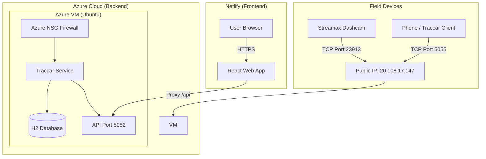

# Traccar Deployment & Connection Guide

## 1. Connection Details

Share these details with the team to configure devices.

*   **Server IP (Host):** `20.108.17.147`
*   **Web Dashboard:** [Link to your Netlify App] (Port `8082` is the backend API, but use the Netlify frontend)

### Open Ports for Devices

| Device Type | Protocol | Port | Notes |
| :--- | :--- | :--- | :--- |
| **Streamax Dashcam** | TCP | **23913** | Primary device for this project. Point the dashcam config to `20.108.17.147:23913`. |
| **Mobile Phone** | HTTP/TCP | **5055** | For testing with the "Traccar Client" iOS/Android app. Protocol: `OsMand`. |

> [!NOTE]
> If you have a different device model, we must explicitly open its specific port on the Azure Firewall (NSG). Let the architecture team know.

---

## 2. System Architecture

The system follows a split Deployment architecture:

## 3. How to Connect a New Device

1.  **Configure the Device:**
    *   Set **Server IP**: `20.108.17.147`
    *   Set **Port**: `23913` (for Streamax) or `5055` (for Phones).
2.  **Register in Dashboard:**
    *   Get the **Device Identifier** (IMEI or Unique ID) from the device.
    *   Log in to the Web App.
    *   Click `+` to add a device.
    *   Enter the Name and Identifier.
3.  **Verify:**
    *   Wait for the device to send a packet.
    *   The status should change to `Online` (Green) on the map.

## 4. Troubleshooting

*   **Device Status is unknown/offline:**
    *   Check if the device has a GPS fix (needs clear view of sky).
    *   Check if the SIM card has data.
    *   Ensure the port `23913` (or `5055`) is correctly entered.
*   **Cannot access Web App:**
    *   Check if the backend is up: `curl http://20.108.17.147:8082/api/server` should return `200 OK`.
